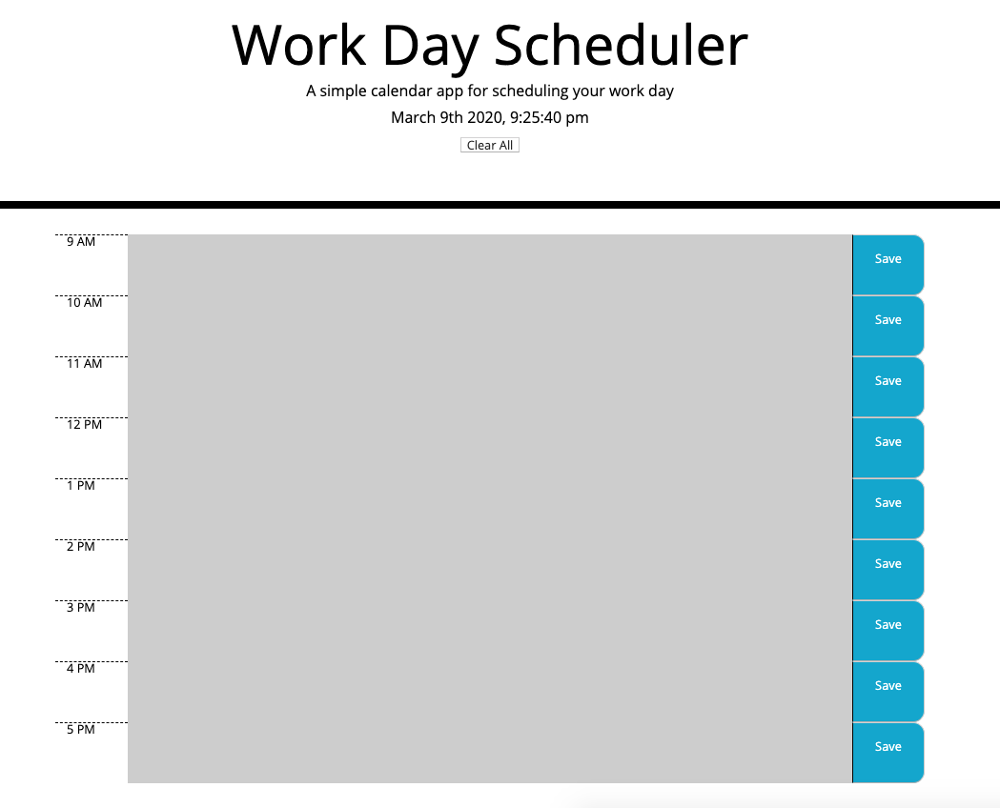

# Day Planner

I created a simple calendar application that allows the user to save events for each hour of the day. This app will run in the browser and feature dynamically updated HTML and CSS powered by jQuery.

The app displays standard business hours (9 a.m. to 5 p.m.). Each time slot represents one hour and contain the following:

* The time

* A field to hold user input

* A save button

Clicking on the save button will store the time and user input in `localStorage`.

Additionally, each hour is color coded to relect whether the time slot is in the past, the present, or the future that changes depending on the time of the day.

## User Story

AS AN employee with a busy schedule

I WANT to add important events to a daily planner

SO THAT I can manage my time effectively 

## Business Context

Poor time management can result in missed meetings and deadlines or create the appearance of unprofessionalism. A daily planner allows employees to see their day at a glance, schedule time effectively, and improve productivity. 

Check it out: 

https://kimiinglet.github.io/todo_list/

https://github.com/kimiinglet/todo_list.git

